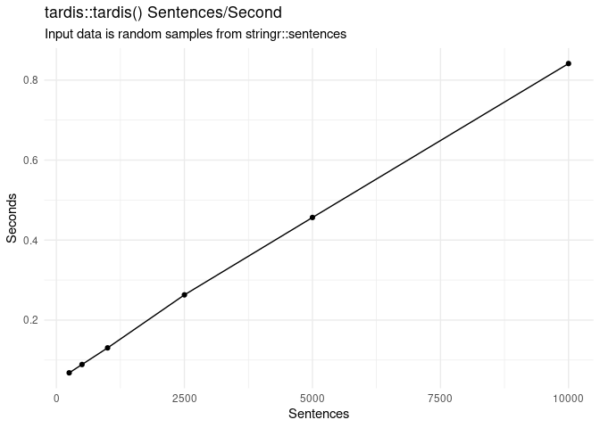

<!-- README.md is generated from README.Rmd. Please edit that file -->

# tardis: Text Analysis with Rules and Dictionaries for Inferring Sentiment (and more!)

<!-- badges: start -->

[](https://CRAN.R-project.org/package=tardis)
[](https://lifecycle.r-lib.org/articles/stages.html#experimental)
[](https://app.codecov.io/gh/chris31415926535/tardis?branch=main)
[](https://github.com/chris31415926535/tardis/actions/workflows/R-CMD-check.yaml)
<!-- badges: end -->

TARDIS uses simple rules and dictionaries to analyze text. By default it
uses built-in dictionaries to measure sentiment, i.e. how happy or sad
text is. It handles negations, so it knows “not happy” means “sad”, and
it handles modifiers, so it knows that “very happy” is more happy than
“happy”. TARDIS also supports unicode emojis and multi-word tokens (so
you can tell it that “supreme court” is neutral, instead of a
combination of “supreme” (positive) and “court” (neutral). TARDIS also
supports user-defined dictionaries and can be used to analyze other
constructs beyond sentiment.

## Features

-   Handles ASCII and UTF-8 emojis :) 👍
-   Based on simple surveyable rules
-   Highly customizable
-   Pretty fast, uses cpp11

## Installation

The latest stable CRAN version can be installed as follows:

``` r
install.packages("tardis")
```

You can install the latest development version of tardis from GitHub
like so:

``` r
devtools::install_github("chris31415926535/tardis")
```

## Example

Let’s find the sentiment of a few sentences:

``` r
library(tardis)

text <- c("I am happy.",
          "I am really happy.",
          "I am really happy!",
          "I am really not happy!")

tardis::tardis(text) %>%
  dplyr::select(sentences, score) %>%
  knitr::kable()
```

| sentences              |      score |
|:-----------------------|-----------:|
| I am happy.            |  0.5718850 |
| I am really happy.     |  0.6695383 |
| I am really happy!     |  0.7197007 |
| I am really not happy! | -0.6094200 |

Tardis also handles blocks of text differently from other
sentiment-analysis algorithms, most of which treat blocks of text as
single sentences. Instead, Tardis breaks each text into individual
sentences, finds their sentiment, and then returns the text’s mean,
standard deviation, and range. This can be helpful for finding large
swings in sentiment that could indicate irony or conflict in texts that
may be close to neutral overall.

``` r
text <- "This sentence is neutral. This one is really happy! This one is absolutely miserable."

tardis::tardis(text) %>%
  dplyr::select(sentences, score, score_sd, score_range) %>%
  knitr::kable()
```

| sentences                                                                             |     score | score_sd | score_range |
|:--------------------------------------------------------------------------------------|----------:|---------:|------------:|
| This sentence is neutral. This one is really happy! This one is absolutely miserable. | 0.0683228 | 0.655876 |    1.311661 |

Or even passive-aggressive hostility, like this exchange that’s neutral
overall but still clearly hostile:

``` r
text <- "Die in a fire 😘" 

tardis::tardis(text) %>%
  dplyr::select(sentences, score, score_sd, score_range) %>%
  knitr::kable()
```

| sentences       |      score |  score_sd | score_range |
|:----------------|-----------:|----------:|------------:|
| Die in a fire 😘 | -0.0664554 | 0.9568319 |    1.353165 |

Tardis also makes it easy to use custom dictionaries, which means it can
be used to measure other constructs like emotion, rank texts based on
their similarity to a custom dictionary derived from a cluster analysis
or LDA, or many other text-based natural language analyses.

## The algorithm in brief

Tardis first decomposes texts into tokens (words, emojis, or multi-word
strings), which are scored based on the input dictionary, if they’re in
ALL CAPS, and the three preceding tokens. Negations like “not” will
reverse and reduce a token’s score, and modifiers will either increase
(e.g. “very”) or decrease (e.g. “slightly”) its score. Sentences are
scored by summing token scores, adjusting for punctuation, and scaling
results (nonlinearly) so they’re between -1 and 1. Text scores are means
of sentence scores. Each of these steps can be tweaked or disabled by
user-supplied parameters. Tardis’s algorithm is inspired by other
approaches, notably VADER, although it differs from this latter in three
key respects: first, it is much more customizable; second, token score
adjustments are all multiplicative, making the order of operations
unimportant; and third, there are no special cases or exceptions, making
the rules simpler and more intuitive.

## Benchmarking

The major bottlenecks have been addressed using `cpp11` so the function
is reasonably fast, handling over 10,000 sentences/second using test
data from `stringr::sentences`:



## Known issues / Possible future directions

-   ACII emojis are slow to process, so the default dictionary includes
    only some of them.
-   The default dictionary merges data from two sources, one for text
    and ASCII emojis and another for UTF-8 emojis, and while I’ve tried
    to normalize them it’s likely possible to improve on this.
-   It would be good to do more testing/validation of the default
    settings.
-   It would be good to have suggestions for threshold positive/negative
    values in various scenarios.

## Similar projects and packages

-   Tardis was directly inspired by
    [VADER](https://github.com/cjhutto/vaderSentiment), which has an R
    implementation on CRAN in the package
    [vader](https://cran.r-project.org/package=vader), and an
    implementation I wrote that’s not on cran called
    [tidyvader](https://github.com/chris31415926535/tidyvader). Tardis
    also incorporates sentiment data from the VADER project.
-   [Tidytext](https://github.com/juliasilge/tidytext) is a wonderful
    package for text mining in R. Tardis incorporates some sentiment
    data from Tidytext.

## References

Hutto, C.J. & Gilbert, E.E. (2014). VADER: A Parsimonious Rule-based
Model for Sentiment Analysis of Social Media Text. Eighth International
Conference on Weblogs and Social Media (ICWSM-14). Ann Arbor, MI, June
2014.

Kralj Novak P, Smailović J, Sluban B, Mozetič I (2015) Sentiment of
Emojis. PLoS ONE 10(12): e0144296.
<https://doi.org/10.1371/journal.pone.0144296>

Minqing Hu and Bing Liu, “Mining and summarizing customer reviews.”,
Proceedings of the ACM SIGKDD International Conference on Knowledge
Discovery & Data Mining (KDD-2004), Seattle, Washington, USA, Aug 22-25,
2004.
